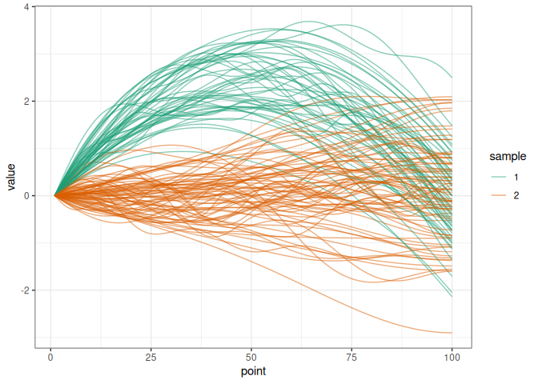

# Statistical Testing for Functional Data

<!-- badges: start -->
<!-- badges: end -->

[Website](https://gdurif.pages.math.cnrs.fr/funStatTest/) and [Source
code](https://plmlab.math.cnrs.fr/gdurif/funStatTest)

------------------------------------------------------------------------

The `funStatTest` package implements various statistics for two sample
comparison testing regarding functional data introduced and used in
Smida et al 2022 \[1\].

This package is developed by:

- Zaineb Smida ([ORCID](https://orcid.org/0000-0002-9974-299X))
- Ghislain Durif
  ([link](https://gdurif.perso.math.cnrs.fr/)\|[ORCID](https://orcid.org/0000-0003-2567-1401))
- Lionel Cucala ([link](https://imag.umontpellier.fr/~cucala/))

## Installation

To install the `funStatTest` package, you can run:

``` r
install.packages("funStatTest")
```

You can also install the development version of `funStatTest` with the
following command:

``` r
remotes::install_git("https://plmlab.math.cnrs.fr/gdurif/funStatTest")
```

## Documentation

See the package
[vignette](https://gdurif.pages.math.cnrs.fr/funStatTest/articles/getting-started-with-functional-statistical-testing.html)
and [function
manuals](https://gdurif.pages.math.cnrs.fr/funStatTest/reference/index.html)
for more details about the package usage.

## Development

The `funStatTest` was developed using the
[`fusen`](https://thinkr-open.github.io/fusen/index.html) package \[2\].
See in the `dev` sub-directory in the package sources for more
information, in particular:

- the file `dev/dev_history.Rmd` describing the development process
- the file `dev/flat_package.Rmd` defining the major package functions
  (from which the vignette is extracted)
- the file `dev/flat_internal.Rmd` defining package internal functions

The `funStatTest` website was generated using the
[`pkgdown`](https://pkgdown.r-lib.org/) package \[3\].

## Example

This is a basic example which shows you how to solve a common problem:

``` r
library(funStatTest)
```

### Data simulation

We simulate two samples of trajectories diverging by a delta function.

``` r
simu_data <- simul_data(
    n_point = 100, n_obs1 = 50, n_obs2 = 75, c_val = 10, 
    delta_shape = "quadratic", distrib = "normal"
)

plot_simu(simu_data)
```



We extract the matrices of trajectories associated to each sample:

``` r
MatX <- simu_data$mat_sample1
MatY <- simu_data$mat_sample2
```

And we compute the different statistics for two sample function data
comparison presented in Smida et al 2022 \[1\]:

``` r
res <- comp_stat(MatX, MatY, stat = c("mo", "med", "wmw", "hkr", "cff"))
res
#> $mo
#> [1] 0.9486241
#> 
#> $med
#> [1] 0.9517283
#> 
#> $wmw
#> [1] 0.9074959
#> 
#> $hkr
#>         [,1]
#> T1 31987.663
#> T2  8489.875
#> 
#> $cff
#> [1] 14150.96
```

We can also compute p-values associated to these statistics:

``` r
# small data for the example
simu_data <- simul_data(
    n_point = 20, n_obs1 = 4, n_obs2 = 5, c_val = 10, 
    delta_shape = "constant", distrib = "normal"
)

MatX <- simu_data$mat_sample1
MatY <- simu_data$mat_sample2

res <- permut_pval(
    MatX, MatY, n_perm = 200, stat = c("mo", "med", "wmw", "hkr", "cff"), 
    verbose = TRUE)
res
#> $mo
#> [1] 0.01492537
#> 
#> $med
#> [1] 0.0199005
#> 
#> $wmw
#> [1] 0.01492537
#> 
#> $hkr
#>          T1          T2 
#> 0.014925373 0.009950249 
#> 
#> $cff
#> [1] 0.009950249
```

> :warning: computing p-values based on permutations may take some time
> (for large data or when using a large number of simulations. :warning:

And we can also run a simulation-based power analysis:

``` r
# simulate a few small data for the example
res <- power_exp(
    n_simu = 20, alpha = 0.05, n_perm = 200, 
    stat = c("mo", "med", "wmw", "hkr", "cff"), 
    n_point = 25, n_obs1 = 4, n_obs2 = 5, c_val = 10, delta_shape = "constant", 
    distrib = "normal", max_iter = 10000, verbose = FALSE
)
res$power_res
#> $mo
#> [1] 1
#> 
#> $med
#> [1] 1
#> 
#> $wmw
#> [1] 1
#> 
#> $hkr
#> T1 T2 
#>  1  1 
#> 
#> $cff
#> [1] 1
```

## References

<div id="refs" class="references csl-bib-body">

<div id="ref-smida2022" class="csl-entry">

<span class="csl-left-margin">1.
</span><span class="csl-right-inline">**Smida**, **Z**, **Cucala**,
**L**, **Gannoun**, **A**, and **Durif**, **G** 2022 A median test for
functional data. *Journal of Nonparametric Statistics*, 34(2): 520–553.
DOI:
https://doi.org/[10.1080/10485252.2022.2064997](https://doi.org/10.1080/10485252.2022.2064997)</span>

</div>

<div id="ref-fusen" class="csl-entry">

<span class="csl-left-margin">2.
</span><span class="csl-right-inline">**Rochette**, **S** 2022 *Fusen:
Build a package from rmarkdown files*. URL
<https://CRAN.R-project.org/package=fusen></span>

</div>

<div id="ref-pkgdown" class="csl-entry">

<span class="csl-left-margin">3.
</span><span class="csl-right-inline">**Wickham**, **H**,
**Hesselberth**, **J**, and **Salmon**, **M** 2022 *Pkgdown: Make static
HTML documentation for a package*. URL
<https://CRAN.R-project.org/package=pkgdown></span>

</div>

</div>
